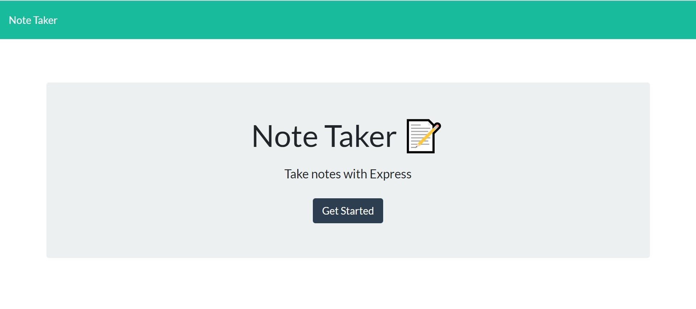
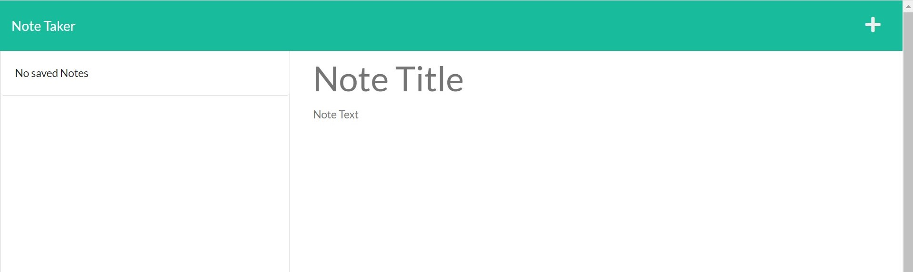
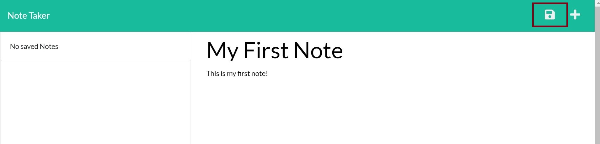
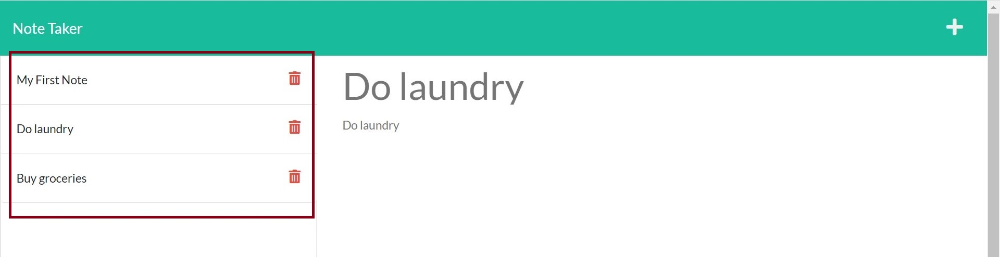
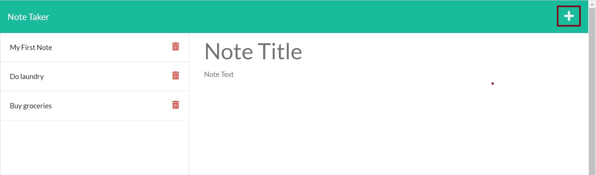
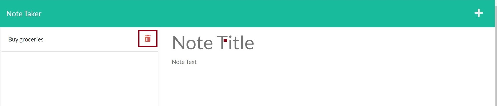

# Note Taker

## Description

The note taker application has been created for users to be able to write and save notes. This application uses an express.js back end which save and retrieve data from a JSON file.

Note Taker has been deployed to Heroku, please [click here](https://murmuring-mountain-65060.herokuapp.com/) to be directed to the application.

## Usage

Below screenshots of some of the features for reference.

- Note Taker user interface;

  

- When the user clicks the "Get Started" button, it is directed to the notes page ;

  

- Notes can be saved using the save button on the top right side corner.

  

- All existing notes are displayed on the left side, where it can be viewed when clicked on the title.

  

- New notes can be created using the + sign on the top right corner.

  

- Notes can be deleted using the bin icon on the left side, as shown below.

  
